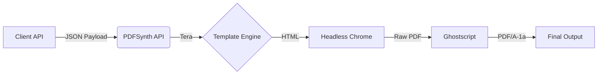

# ⚡ PDFSynth

PDFSynth is a high-performance, agnostic microservice designed to render PDF/A-1a compliant documents from HTML templates and JSON data.

Built by Synth Solutions, it leverages the safety of Rust, the accuracy of Headless Chrome, and the robustness of Ghostscript to ensure your documents are perfectly rendered and archived forever.

## 🏗 Architecture

PDFSynth follows a clean "Input-Process-Output" architecture:



## 🚀 Features

- **Platform Agnostic**: Runs anywhere Docker runs (Kubernetes, AWS ECS, Azure, Google Cloud Run, DigitalOcean).
- **Stateless & Scalable**: No persistent state; scales horizontally instantly.
- **PDF/A Compliance**: Native support for ISO 19005-1 (PDF/A-1a) for long-term archiving.
- **Dynamic Templating**: Uses Tera (Jinja2-like syntax) for powerful logic.
- **Secure**: Runs as a non-root user with hardened browser flags.

## 🛠️ Usage

### Option 1: Run with Docker (Recommended)

You can pull and run the container directly from GitHub Container Registry:

```bash
# Pull the latest image
docker pull ghcr.io/jospnunes/pdfsynth:latest

# Run the container
docker run -p 8080:8080 --init ghcr.io/jospnunes/pdfsynth:latest
```

Or build locally:

```bash
# Build the image
docker build -t pdfsynth .

# Run the container
docker run -p 8080:8080 --init pdfsynth
```

### Option 2: Docker Compose

Easily integrate PDFSynth into your existing stack using `docker-compose.yml`:

```yaml
services:
  pdf-engine:
    image: ghcr.io/jospnunes/pdfsynth:latest
    ports:
      - "8080:8080"
    restart: always
    deploy:
      resources:
        limits:
          memory: 1G
```

## 🔌 API Reference

### POST /render

Generates a PDF based on the provided template and data.

**Request:**

```http
POST /render
Content-Type: application/json

{
  "template_html": "<html><body><h1>Certificate for {{ name }}</h1></body></html>",
  "data": {
    "name": "João Silva"
  },
  "options": {
    "pdf_a": true,       // Enables PDF/A conversion (slower but compliant)
    "paper_format": "A4" // A4, Letter, Legal
  }
}
```

**Response:**

- `200 OK`: Binary PDF file.
- `400 Bad Request`: Template syntax error.
- `500 Internal Server Error`: Rendering engine failure.

### GET /health

Health check endpoint for load balancers and orchestrators (K8s probes).

```json
{"status": "ok"}
```

## ⚙️ Configuration

PDFSynth is configured via Environment Variables, following the 12-Factor App methodology.

| Variable | Default | Description |
|----------|---------|-------------|
| `PORT` | `8080` | The HTTP port the server listens on. |
| `RUST_LOG` | `info` | Log level (debug, info, warn, error). |

## 📦 Deployment Strategies

Since PDFSynth is packaged as a standard Docker container, it can be deployed to any provider:

- **Kubernetes (Helm/Kustomize)**: Define a Deployment and Service targeting port 8080.
- **AWS ECS / Fargate**: Push the image to ECR and run as a task definition.
- **Google Cloud Run**: Push to GCR/Artifact Registry and deploy as a managed service.
- **DigitalOcean App Platform**: Deploy directly from the container registry.

**Hardware Recommendation:**

- **Memory**: Minimum 1GiB RAM (Headless Chrome is memory intensive).
- **CPU**: 1 vCPU is sufficient for low to medium traffic.

⚖️ License

This project is licensed under the MIT License - see the LICENSE file for details.

Copyright © 2025 Synth Solutions.